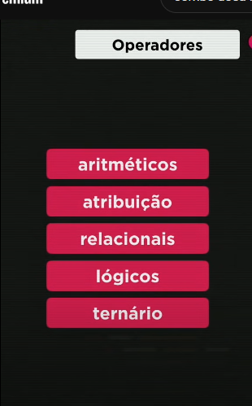

1 - resto da divisao

2 - 8

3 - 15

4 - adicionar ou subtrair uma unidad

=== é o que pergunta se o tipo é o mesmo. ou seja 5 nao é a mesma coisa que '5'
porq um é numero e outro string

! é negação.
 só se os dois forem true
 basta um ser true
ordem de opradores - primeiro operador aritimetico, depois relacional, depois

